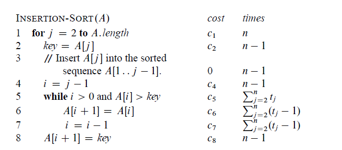
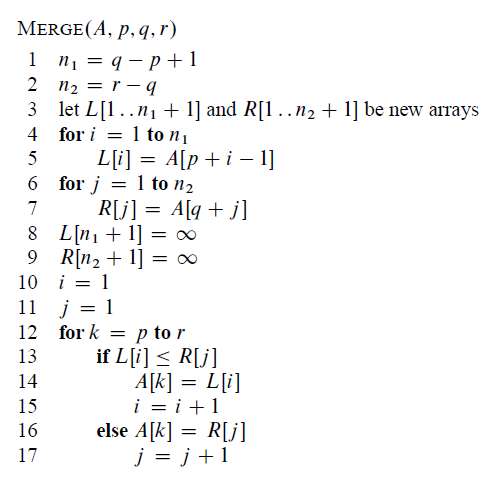

The `insert sort` is just the usual strategy when you play cards

The `merge sort` is

<ol>
  <li>Divide the cards into two piles</li>
  <li>Sort each pile individually</li>
  <li>Merge them together</li>
</ol>

